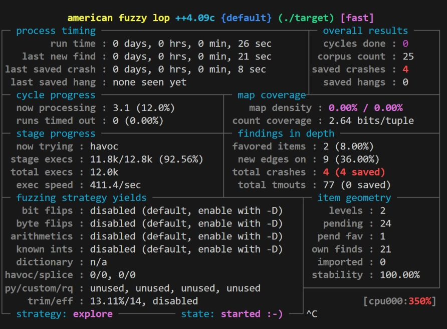

# CLIFuzz
This project can be used to learn how to develop a simple CLI tool and run it against both AFL and ubsan.

### AFL tool
AFL tool set up in docker environment as AFL was initially cloned from: https://github.com/google/AFL
### AFL argument passing quirks
AFL does not by default support passing argv style arguments to the target application.To allow the file to work use vim editor to include the following. 
At the top of the target.c file include: 
**/AFL/experimental/argv_fuzzing/argv-fuzz-inl.h** 

Add this to the main method in target.c file: 
**AFL_INIT_SET0(“target”)** 

The following file gives an example of how this works: https://github.com/mirrorer/afl/blob/master/experimental/argv_fuzzing/argv-fuzz-inl.h
  
### CLI Tool
The CLI tool named target was built with the help of copilot. The tool was intentionally built with bugs (buffer overflow, uninitialized variables, off-by-one error, null pointer deference, memory leak) for testing purposes. The CLI is programmed to allows simple arithmetic functions such as adding, subtracting multiplying and dividing. The tool also accepts a file with the functions. The command line arguments that can be used look like this: 
- ./target add 1 2
- ./target sub 1 2
- ./target mul 1 2 
- ./target divi 1 2
- ./target test.txt
  
### Seed file
Before testing seed files the CLI tool needs to be compiled: You can do this using the following command or any of the compiling commands under the 'Running fuzz / ubsan header': 
**gcc target.c fno-stack-protector -o target** 

The **tests.txt** seed file has been placed inside the **in** directory. Test CLI by typing the following into the command line: 
**./target /in/test.txt**  

Vim editor can be used to add additional seed files. This should lokk like this: 
**vim new_text_name.txt**
  
### Dockerfile
The docker file sets up initial environment for this project with all the features required for this project.  

To build the file use: 
 **docker build -t target-image .** 

To run the file use:  
**docker run -d -p 5000:5000 target-image**
  
### Running fuzz / ubsan
Inside docker environment use the following command to instrument for AFL,  use afl-fuzz:   **afl-gcc /CLIFuzz/target.c -fno-stack-protector -o target** 

Or use this to compile ubsan: 
**afl-gcc -fsanitize=undefined /CLIFuzz/target.c  -o target** 

Once compiled used following command to run AFL fuzzing or ubsan: **AFL_I_DONT_CARE_ABOUT_MISSING_CRASHES=1 afl-fuzz -n -i in -o out -- ./target** 

Flags:
- **-fno-stack-protector** disables stack protection and runtime protection allowing program to crash
  
### Relavent Extensions in VSC
- CodeSpace 
- Copilot
- Docker

